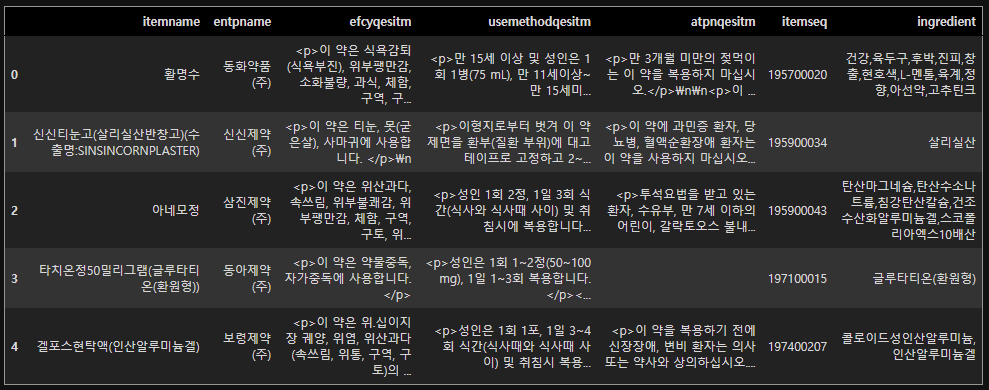
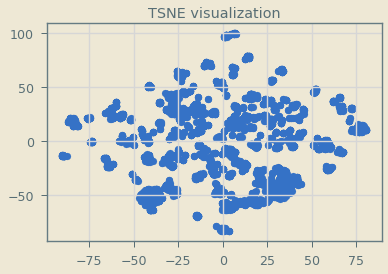

# Medicine2vec

일반의약품 데이터를 크롤링 및 분석하여, 의약품의 특징들에 대해 리서치하는 곳입니다.

_________________

- [crawling](https://github.com/hskimim/medicine2vec/blob/master/data%20crawl.ipynb) : 의약품에 대한 공공데이터 포털의 api 를 사용하였습니다.

_______________________

- [project 1](https://github.com/hskimim/medicine2vec/blob/master/clustering.ipynb) : 
    - objective : 특정 의약품에 대한 vector 를 학습시키고, 클러스터링을 통해, 의약품 분류
    
    - feature : 의약품의 성분(ingredient), 증상(symptom), 복용 시 주의 사항(caution)
    
    - pre-processing : 모든 데이터가 string 자료형 및 한글이며, python regex 를 통해 전처리를 수행하였음  
    - model : 
        - ingredient/symptom : 같은 의약품에 표기되는 성분, 증상은 유사한 성질을 띄고 있다고 가정, 
        augmentation 을 동반한 fasttext model 사용, fasttext 모델 사용 이유는, 
        character level 로 유사한 성분과 증상의 특징에 기인함 (ex. 니코틴, 니코틴산아미드, 근육통, 근육피로)
        - caution : word embedding 이후, averaging 을 통해 문장 벡터 생성
        - concatenation + svd : 3 가지 feature vector 생성 후, concat + svd 를 통해 동일한 vector space 에 projection 하여, 
        redundancy 와 noise 를 줄였음
        
    - embedding visualization : 
        - TSNE 사용, 아래는 TSNE 를 통한 최종 medicine vector 의 시각화 플롯
        

    - clustering algorithm : 
        - deterministic 한 결과를 추출해내고, cosine similarity 를 distance metric 으로 사용하기 위해,
        Agglomerative Hierarchical Clustering 알고리즘을 사용하였음.
        
    - Experiments & Test :
        - 학습시킨 embedding vector 가 의약품을 잘 분류하는지와 각각의 feature 를 잘 표현하는 지를 확인하기
        위해 2가지 실험을 설계하였음
        - 자세한 내용은 첨부한 ipython notebook 참고
        
_______________________ 