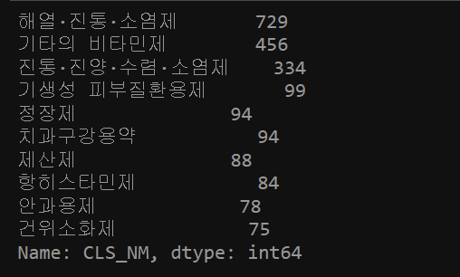
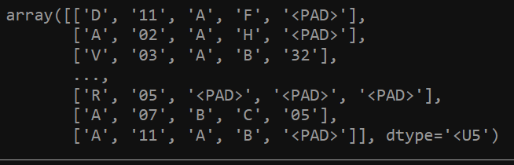

# Medicine2vec

일반의약품 데이터를 크롤링 및 분석하여, 의약품의 특징들에 대해 리서치하는 곳입니다.

_________________

- [crawling](https://github.com/hskimim/medicine2vec/blob/master/crawling/data%20crawl.ipynb) : 의약품에 대한 공공데이터 포털의 api 를 사용하였음.

- [labeling](https://github.com/hskimim/medicine2vec/blob/master/crawling/data%20crawl[label].ipynb) : 
    - 의약품에 대한 분류 라벨은 2가지로 선정하였고, 이는 아래와 같다.
        - 의약품 분류 코드 [[코드]](https://github.com/hskimim/medicine2vec/blob/master/labeling/cls_code_labeling.ipynb)
         [[예제]](http://www.khmcpharm.com/Lib/Modules/MediSearch/popup_01.html)
            - 사실상 ATC 분류 코드에 의존하며, 분류 코드를 crawling 해온 것으로, missing data 가 존재함.
            

        - ATC 분류 코드  [[코드]](https://github.com/hskimim/medicine2vec/blob/master/labeling/atc_code_labeling.ipynb)
        [[예제]](https://m.blog.naver.com/PostView.naver?isHttpsRedirect=true&blogId=39954&logNo=50120700741)
            - 총 5단계로 의약품을 계층적으로 분류하고 있으며, 이에 따라, 사전에 선택한 단계로 라벨링을 할 수 있음. (일종의 hyper-parameter)
            

_______________________

- [project 1](https://github.com/hskimim/medicine2vec/blob/master/project1/clustering.ipynb) : 
    - objective : 특정 의약품에 대한 vector 를 학습시키고, 클러스터링을 통해, 의약품 분류
    
    - feature : 의약품의 성분(ingredient), 증상(symptom), 복용 시 주의 사항(caution)
    
    - pre-processing : 모든 데이터가 string 자료형 및 한글이며, python regex 를 통해 전처리를 수행하였음  
    - model : 
        - ingredient/symptom : 같은 의약품에 표기되는 성분, 증상은 유사한 성질을 띄고 있다고 가정, 
        augmentation 을 동반한 fasttext model 사용, fasttext 모델 사용 이유는, 
        character level 로 유사한 성분과 증상의 특징에 기인함 (ex. 니코틴, 니코틴산아미드, 근육통, 근육피로)
        - caution : word embedding 이후, averaging 을 통해 문장 벡터 생성
        - concatenation + svd : 3 가지 feature vector 생성 후, concat + svd 를 통해 동일한 vector space 에 projection 하여, 
        redundancy 와 noise 를 줄였음
        
    - embedding visualization : 
        - TSNE 사용, 아래는 TSNE 를 통한 최종 medicine vector 의 시각화 플롯
        

    - clustering algorithm : 
        - deterministic 한 결과를 추출해내고, cosine similarity 를 distance metric 으로 사용하기 위해,
        Agglomerative Hierarchical Clustering 알고리즘을 사용하였음.
        
    - Experiments & Test :
        - 학습시킨 embedding vector 가 의약품을 잘 분류하는지와 각각의 feature 를 잘 표현하는 지를 확인하기
        위해 2가지 실험을 설계하였음
        - 자세한 내용은 첨부한 ipython notebook 참고
        
_______________________ 

- [project 2](https://github.com/hskimim/medicine2vec/blob/master/project2/projection.ipynb) : 

    - objective : project 1에서 학습시킨 feature vector 를 추가적인 모델링을 통해 향상시키며, 
    동일한 objective 을 달성하려 함. 
    
    - feature : 
        - 학습에 사용된 feature : 의약품의 성분(ingredient), 증상(symptom)
        - 사용되지 않은 feature : 복용 시 주의 사항(caution) 
            - feature embedding 이 잘 수행되었는지 performance measure 에 일종의 label 로 사용됨
    
    - pre-processing : 모든 데이터가 string 자료형 및 한글이며, python regex 를 통해 전처리를 수행하였음
        
    - model : 
        - fasttext 를 통해 pretrain 한 ingredient/symptom vector 를 더 잘 학습시키기 위한 방법을 고안
            - assumption : ingredient/symptom 은 분명한 관계가 존재하고, ("어떤 증상이 있을 때, 특정 성분이 있는 약을 먹는다") 이러한 관계를 embedding 에
            잘 투영하는 것이 더 나은 표현을 만드는 것. 즉, {key : value} pair 를 잘 mapping 시키는 학습을 진행한다.
            - logic : bi-lingual word embedding 학습 방법을 제안한 [논문](https://arxiv.org/pdf/1309.4168.pdf) 을 따라, ingredient vector $V_{ingre}$ 를 
            symptom vector $V_{symp}$ 로 변환해주는 linear projection layer $W_{p}$ 를 학습하되, 우리가 원하는 것은 $W$ 가 아닌, $V$ 이므로,
            학습 과정에서 $W$ 도 함께 업데이트 해준다. (논문에서는 $V$ 만 학습한다.)
                   
    - embedding visualization : 
        - project 1 과 동일

    - clustering algorithm : 
        - project 1 과 동일
        
    - Experiments & Test :
        - 학습시킨 embedding vector 가 의약품을 잘 분류하는지와 각각의 feature 를 잘 표현하는 지를 확인하기
        위해 2가지 실험을 설계하였음
        - 실험 결과에 따라, 현재 설계한 모델링이 가지는 한계점을 발견하였고 이에 개선된 모델링을 해당 project 의 sub-section 에 진행할 예정
        - 자세한 내용은 첨부한 ipython notebook 참고
        
_______________________ 